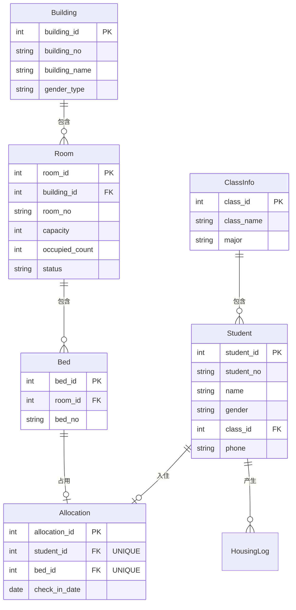

# 高校学生宿舍管理系统 — 数据库课程设计文档

> 数据库：Microsoft SQL Server 2025（Developer Edition）
> 应用系统：C# WinForms（.NET，VS Code + dotnet SDK）
> 文档目录：`D:\DataBase\KESHE`
> 编写日期：2026-06-11

---

## 1. 项目概述

本系统面向高校学生宿舍的日常管理，覆盖宿舍楼、寝室、床位、学生等基础信息的维护，以及学生入住、调宿、退宿等住宿业务，并提供空床位查询、学生住宿信息查询等功能。系统采用 **SQL Server 数据库 + C# WinForms 三层架构应用程序** 实现，数据库端通过约束、视图、存储过程、触发器保证数据的完整性与业务自动化，并支持数据库备份、恢复及基于时间点的恢复（PITR）。

---

## 2. 需求分析

### 2.1 功能需求

| 编号 | 功能 |
|---|---|
| (1) | 管理宿舍楼信息、寝室信息（楼号、房号、床位数量、已住人数）、学生住宿分配 |
| (2) | 实现学生入住、调宿、退宿登记 |
| (3) | 提供宿舍空床位查询、学生住宿信息查询 |
| (4) | 约束：每个床位只能分配一名学生，且学生只能在一个寝室 |
| (5) | 视图：显示每个寝室的已住人数、空床位数 |
| (6) | 存储过程：输入楼号和房号，返回该寝室所有住宿学生的名单 |
| (7) | 触发器：学生退宿时自动更新对应寝室的已住人数；若寝室无学生则标记为空闲 |
| (8) | 数据库的备份和恢复，并支持基于时间点的恢复 |

### 2.2 课程设计交付要求映射

| 要求 | 在本文档中的体现 |
|---|---|
| ③ E-R 图与关系模式转换 | 第 3 章、第 4 章 |
| ④ 由 E-R 图生成数据库表 | 第 4 章、SQL 脚本 |
| ⑤ 完整性、安全性保证 | 第 6 章 |
| ⑥ 物理设计 | 第 5 章 |
| ⑦ 实施维护计划 | 第 10 章 |
| ⑧ 应用系统设计与实现 | 第 9 章 |

---

## 3. 概念结构设计（E-R 模型）

### 3.1 实体与联系

- **宿舍楼 Building**：一栋楼包含多个寝室（1:N）。
- **寝室 Room**：一个寝室包含多张床位（1:N）。
- **床位 Bed**：一张床位最多被一名学生占用（1:0..1）。
- **班级 ClassInfo**：一个班级包含多名学生（1:N）。
- **学生 Student**：一名学生最多有一条住宿分配（1:0..1）。
- **住宿分配 Allocation**：关联实体，把"一张床位"与"一名学生"绑定。
- **管理员 Admin**：独立实体，用于系统登录。
- **住宿变更记录 HousingLog**：记录入住/调宿/退宿操作流水。

### 3.2 E-R 图（Mermaid）



> 关键约束（对应要求 4）：`Allocation.student_id` 唯一 → 学生只能在一个寝室；`Allocation.bed_id` 唯一 → 每个床位只能分配一名学生。

---

## 4. 逻辑结构设计（关系模式 + 范式分析）

### 4.1 关系模式

> 约定：**加粗**为主键，*斜体*为外键，(U) 表示唯一约束。

- 管理员 Admin(**admin_id**, username(U), password, real_name)
- 宿舍楼 Building(**building_id**, building_no(U), building_name, gender_type)
- 寝室 Room(**room_id**, *building_id*, room_no, capacity, occupied_count, status)；UNIQUE(building_id, room_no)
- 床位 Bed(**bed_id**, *room_id*, bed_no)；UNIQUE(room_id, bed_no)
- 班级 ClassInfo(**class_id**, class_name(U), major)
- 学生 Student(**student_id**, student_no(U), name, gender, *class_id*, phone)
- 住宿分配 Allocation(**allocation_id**, *student_id*(U), *bed_id*(U), check_in_date)
- 住宿变更记录 HousingLog(**log_id**, *student_id*, *bed_id*, op_type, op_time, operator)

### 4.2 字段明细

**① 管理员 Admin**

| 列名 | 类型 | 约束 | 说明 |
|---|---|---|---|
| admin_id | INT IDENTITY | PK | 编号 |
| username | NVARCHAR(50) | UNIQUE, NOT NULL | 登录名 |
| password | NVARCHAR(100) | NOT NULL | 密码（建议存哈希） |
| real_name | NVARCHAR(50) | NULL | 姓名 |

**② 宿舍楼 Building**

| 列名 | 类型 | 约束 | 说明 |
|---|---|---|---|
| building_id | INT IDENTITY | PK | 楼编号 |
| building_no | NVARCHAR(20) | UNIQUE, NOT NULL | 楼号 |
| building_name | NVARCHAR(50) | NULL | 楼名 |
| gender_type | NVARCHAR(10) | NULL | 男/女楼 |

**③ 寝室 Room**

| 列名 | 类型 | 约束 | 说明 |
|---|---|---|---|
| room_id | INT IDENTITY | PK | 寝室编号 |
| building_id | INT | FK→Building, NOT NULL | 所属楼 |
| room_no | NVARCHAR(20) | NOT NULL | 房号 |
| capacity | INT | NOT NULL, CHECK(capacity>0) | 床位数 |
| occupied_count | INT | NOT NULL DEFAULT 0, CHECK(0≤occupied_count≤capacity) | 已住人数（触发器维护） |
| status | NVARCHAR(10) | NOT NULL DEFAULT '空闲' | 状态：空闲/有人/已满 |

UNIQUE(building_id, room_no)

**④ 床位 Bed**

| 列名 | 类型 | 约束 | 说明 |
|---|---|---|---|
| bed_id | INT IDENTITY | PK | 床位编号 |
| room_id | INT | FK→Room, NOT NULL | 所属寝室 |
| bed_no | NVARCHAR(10) | NOT NULL | 床号 |

UNIQUE(room_id, bed_no)

**⑤ 班级 ClassInfo**

| 列名 | 类型 | 约束 | 说明 |
|---|---|---|---|
| class_id | INT IDENTITY | PK | 班级编号 |
| class_name | NVARCHAR(50) | UNIQUE, NOT NULL | 班级名 |
| major | NVARCHAR(50) | NOT NULL | 专业 |

**⑥ 学生 Student**

| 列名 | 类型 | 约束 | 说明 |
|---|---|---|---|
| student_id | INT IDENTITY | PK | 学生编号 |
| student_no | NVARCHAR(20) | UNIQUE, NOT NULL | 学号 |
| name | NVARCHAR(50) | NOT NULL | 姓名 |
| gender | NVARCHAR(10) | NULL | 性别 |
| class_id | INT | FK→ClassInfo | 所在班级 |
| phone | NVARCHAR(20) | NULL | 联系电话 |

**⑦ 住宿分配 Allocation**

| 列名 | 类型 | 约束 | 说明 |
|---|---|---|---|
| allocation_id | INT IDENTITY | PK | 分配编号 |
| student_id | INT | FK→Student, UNIQUE, NOT NULL | 学生（唯一） |
| bed_id | INT | FK→Bed, UNIQUE, NOT NULL | 床位（唯一） |
| check_in_date | DATE | NOT NULL DEFAULT GETDATE() | 入住日期 |

**⑧ 住宿变更记录 HousingLog**

| 列名 | 类型 | 约束 | 说明 |
|---|---|---|---|
| log_id | INT IDENTITY | PK | 流水号 |
| student_id | INT | FK→Student, NOT NULL | 学生 |
| bed_id | INT | FK→Bed, NULL | 涉及床位 |
| op_type | NVARCHAR(10) | NOT NULL | 入住/调宿/退宿 |
| op_time | DATETIME | NOT NULL DEFAULT GETDATE() | 操作时间 |
| operator | NVARCHAR(50) | NULL | 操作管理员 |

### 4.3 范式（3NF）分析

所有关系均满足第三范式，论证如下：

- **1NF**：所有列均为原子值，无重复组、无多值字段。
- **2NF**：所有表主键均为单一代理键（IDENTITY），不存在"非主属性只依赖部分主键"的情况，自动满足 2NF。
- **3NF（无传递依赖）**：逐表检查非主属性之间不存在函数依赖：
  - **Room**：仅存 `building_id`（外键），**不存"楼号"**。若存楼号则产生 `room_id → building_id → 楼号` 的传递依赖，违反 3NF；现按 3NF 规范只保留外键，楼号通过连接 Building 获得。
  - **Bed**：仅存 `room_id`，不存 `building_id`（可由 `room_id` 推出），避免传递依赖。
  - **Student / ClassInfo**：班级与专业之间存在依赖（班级 → 专业）。为消除 `student_id → class_id → 专业` 的传递依赖，**将班级、专业拆分为独立的 ClassInfo 表**，学生表只保留 `class_id` 外键。这是本设计中范式规范化的典型示例。
  - **Allocation**：只存 `bed_id`，不存 `room_id`（可由 `bed_id` 推出），避免传递依赖。
  - **关于 `occupied_count` / `status`**：在 Room 关系内部，二者仅函数依赖于主键 `room_id`，关系内不存在传递依赖，符合 3NF。它们相对于 Bed/Allocation 属于**受控冗余（物化的派生数据）**，由触发器保证一致性，以满足要求 (1)(7) 与查询性能。

---

## 5. 物理结构设计

- **DBMS**：SQL Server 2025，数据库名 `DormDB`。
- **数据类型**：中文字符统一使用 `NVARCHAR`（Unicode）；主键使用 `INT IDENTITY(1,1)` 自增；日期用 `DATE`，时间戳用 `DATETIME`。
- **索引设计**：
  - 各表主键默认创建**聚集索引**。
  - `Allocation.student_id`、`Allocation.bed_id` 的 UNIQUE 约束自动创建唯一索引（同时支撑要求 4 的约束与查询）。
  - 在外键列（`Room.building_id`、`Bed.room_id`、`Student.class_id`、`Allocation.bed_id`）上建立非聚集索引，加速连接查询。
- **恢复模式**：数据库设为 **完整恢复模式（FULL）**，作为事务日志备份与时间点恢复（PITR）的前提。
- **存储**：数据文件 `DormDB.mdf`、日志文件 `DormDB.ldf`；备份文件统一存放于 `D:\DataBase\KESHE\backup`（实施时创建）。

---

## 6. 数据完整性与安全性设计

### 6.1 完整性

- **实体完整性**：每张表设主键。
- **参照完整性**：所有外键建立 FOREIGN KEY 约束，防止悬挂引用。
- **用户定义完整性**：
  - `CHECK(capacity>0)`、`CHECK(0≤occupied_count≤capacity)`；
  - `Allocation.student_id` / `bed_id` 的 **UNIQUE 约束**，落实"一床一人、一人一寝"（要求 4）；
  - 关键列 NOT NULL、默认值约束。

### 6.2 安全性

- **登录认证**：通过管理员表 Admin 校验账号密码后方可进入系统；密码建议存储哈希值而非明文。
- **应用层防注入**：数据访问层统一使用 **参数化命令（SqlParameter）**，杜绝 SQL 注入。
- **数据库层权限（可选增强）**：为应用创建专用登录账户并仅授予必要表/视图/存储过程的权限，遵循最小权限原则。

---

## 7. 数据库对象设计

### 7.1 视图（要求 5、3）

- **`v_RoomStatus` 寝室状态视图**：连接 Building、Room，输出 `楼号、房号、床位数、已住人数、空床位数(=床位数−已住人数)、状态`。
- **`v_StudentHousing` 学生住宿信息视图**：连接 Student→Allocation→Bed→Room→Building→ClassInfo，输出 `学号、姓名、专业、楼号、房号、床号、入住日期`。

### 7.2 存储过程（要求 6）

- **`usp_GetRoomStudents(@building_no, @room_no)`**：输入楼号、房号，内部解析为 building_id、room_id，连接 Bed→Allocation→Student，返回该寝室住宿学生名单（学号、姓名、床号等）。

### 7.3 触发器（要求 7）

- **`trg_Allocation_Occupancy`**：建于 Allocation 表，覆盖 INSERT/UPDATE/DELETE：
  - **DELETE（退宿）**：对应寝室 `occupied_count − 1`；若降为 0，则 `status = '空闲'`。← 要求 (7)
  - INSERT（入住）：`occupied_count + 1`；满则 `status='已满'`，否则 `'有人'`。
  - UPDATE（调宿）：旧寝室减、新寝室加，各自刷新状态。
  - 实现：基于 `inserted` / `deleted` 表重算受影响寝室的人数与状态。

---

## 8. 备份与恢复方案（要求 8）

### 8.1 前提

数据库设为 **完整恢复模式（FULL）**：
```sql
ALTER DATABASE DormDB SET RECOVERY FULL;
```

### 8.2 备份策略

- **完整备份**：定期（如每日）`BACKUP DATABASE`。
- **事务日志备份**：高频（如每小时）`BACKUP LOG`，记录两次完整备份间的所有变更，是 PITR 的关键。

### 8.3 基于时间点的恢复（PITR）演示流程

1. 执行一次完整备份；
2. 正常运行系统、产生若干操作；记录某一时刻 T（如误删数据前）；
3. 之后发生误操作；
4. 恢复：
   ```sql
   RESTORE DATABASE DormDB FROM DISK='...full.bak' WITH NORECOVERY, REPLACE;
   RESTORE LOG DormDB FROM DISK='...log.trn'
       WITH STOPAT = '2026-06-11 14:30:00', RECOVERY;
   ```
   数据库被精确恢复到时刻 T 的状态。

> 答辩演示建议："插入数据 → 记录时间 → 误删数据 → 用 STOPAT 恢复到误删前"，直观体现时间点恢复。

---

## 9. 应用系统设计（要求 8）

### 9.1 三层架构

- **表示层（Presentation / WinForms 窗体）**：负责界面显示与交互，不直接写 SQL。
- **数据访问层（DAL / ADO.NET）**：`DBHelper` 统一管理连接字符串与参数化命令，封装各表的增删改查、视图查询、存储过程调用。
- **数据库层（SQL Server）**：表、约束、视图、存储过程、触发器。
- **实体类（Model）**：Student、Room、Bed、Allocation 等普通类，在各层间传递数据。

连接字符串：`Server=localhost;Database=DormDB;Trusted_Connection=True;TrustServerCertificate=True;`

### 9.2 界面清单

| 模块 | 窗体 | 功能 | 对应要求 |
|---|---|---|---|
| 登录 | LoginForm | 管理员账号密码登录 | ⑤ |
| 导航 | MainForm | 进入各功能模块 | — |
| 基础信息 | 宿舍楼 / 寝室 / 班级 / 学生管理 | 增删改查；建寝室时按床位数自动生成床位 | (1) |
| 住宿业务 | 入住 CheckInForm | 选学生 + 选空床 → 写入分配 | (2)(4) |
| 住宿业务 | 调宿 TransferForm | 在住学生换到另一空床 | (2) |
| 住宿业务 | 退宿 CheckOutForm | 删除分配（触发器更新人数/标空闲） | (2)(7) |
| 查询 | 空床位查询 | 按楼/寝室列出空床 | (3) |
| 查询 | 学生住宿查询 | 查 v_StudentHousing | (3) |
| 查询 | 寝室名单 | 输楼号+房号，调存储过程 | (6) |
| 运维 | 备份与恢复 | 完整/日志备份、STOPAT 时间点恢复 | (8) |

---

## 10. 数据库实施与维护计划（要求 7）

### 10.1 实施步骤

1. 创建数据库 `DormDB`，设为完整恢复模式；
2. 按依赖顺序建表（Admin、Building、ClassInfo → Room → Bed、Student → Allocation → HousingLog）并建立约束；
3. 创建索引；
4. 创建视图、存储过程、触发器；
5. 插入测试数据（若干楼、寝室、床位、班级、学生）；
6. 搭建 C# WinForms 项目并实现各界面；
7. 联调测试全部功能。

### 10.2 维护计划

- **备份**：每日完整备份 + 每小时日志备份；备份文件异地/多副本保存。
- **完整性检查**：定期 `DBCC CHECKDB` 检查数据库一致性。
- **索引维护**：定期重建/重组碎片化索引。
- **恢复演练**：定期演练备份还原与时间点恢复，确保备份可用。

---

## 附录：表清单速查

| 表 | 中文名 | 主键 | 主要外键 |
|---|---|---|---|
| Admin | 管理员 | admin_id | — |
| Building | 宿舍楼 | building_id | — |
| Room | 寝室 | room_id | building_id |
| Bed | 床位 | bed_id | room_id |
| ClassInfo | 班级 | class_id | — |
| Student | 学生 | student_id | class_id |
| Allocation | 住宿分配 | allocation_id | student_id(U), bed_id(U) |
| HousingLog | 住宿变更记录 | log_id | student_id, bed_id |
