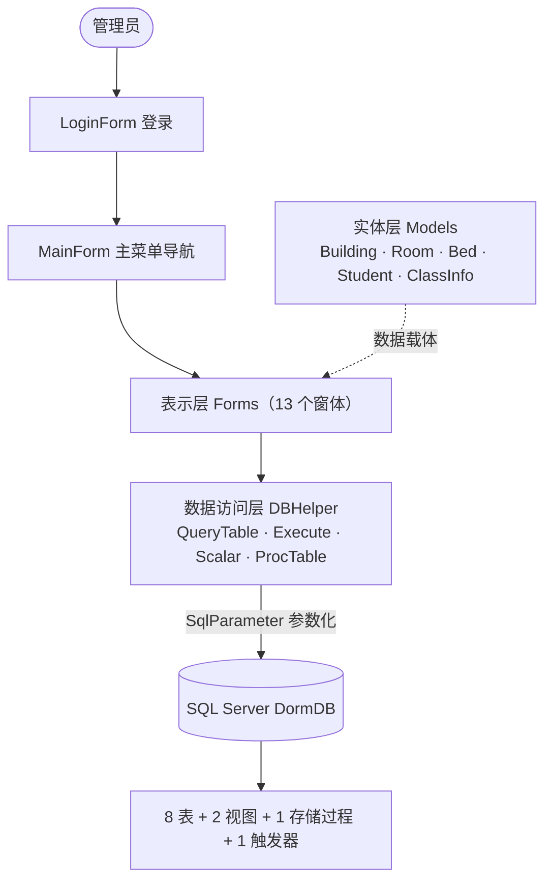
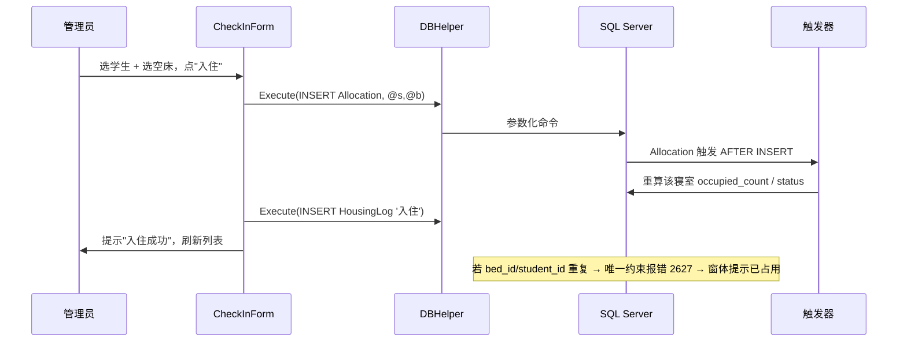

# 宿舍管理系统 — 系统结构与功能模块说明

> 本文从**架构、目录、数据库对象、功能模块**四个维度介绍系统整体，帮助组员快速建立全局认识。
> 偏数据库细节见 [设计文档](宿舍管理系统设计文档.md)，偏操作步骤见 [用户使用手册](用户使用手册.md)，环境搭建见 [环境配置手册](环境配置手册.md)。

---

## 1. 系统概述

高校学生宿舍管理系统，采用 **SQL Server 数据库 + C# WinForms 三层架构桌面应用** 实现，覆盖：

- **基础信息**：宿舍楼、班级、寝室、床位、学生的维护；
- **住宿业务**：入住、调宿、退宿；
- **信息查询**：空床位、学生住宿、寝室名单；
- **系统运维**：数据库备份、恢复与基于时间点的恢复（PITR）。

数据库端通过**约束、视图、存储过程、触发器**保证完整性与业务自动化；应用端统一通过**参数化命令**访问数据库，防止 SQL 注入。

---

## 2. 技术架构（三层 + 实体）



| 层次 | 职责 | 对应代码 |
|---|---|---|
| **表示层** Presentation | 界面显示与交互，不直接写连接逻辑 | `Forms/`（13 个窗体） |
| **数据访问层** DAL | 统一管理连接串与参数化命令，封装查询/增删改/标量/存储过程 | `DAL/DBHelper.cs` |
| **数据库层** Database | 表、约束、索引、视图、存储过程、触发器 | `DormDB`（`sql/01~09`） |
| **实体层** Model | 普通 POCO，在各层间传递数据 | `Models/`（5 个实体） |
| **配置** | 连接字符串常量 | `AppConfig.cs` |
| **入口** | 先登录、成功后开主窗体 | `Program.cs` |

> 设计要点：表示层 → DAL → 数据库**单向依赖**；所有 SQL 经 `SqlParameter` 参数化，天然防注入。

---

## 3. 项目目录结构

```
src/DormManagement/
├─ Program.cs                 入口：弹登录 → 成功后开主窗体
├─ AppConfig.cs               连接字符串常量
├─ DormManagement.csproj      项目文件（net10.0-windows, WinForms, SqlClient）
├─ Models/                    实体类（POCO）
│   ├─ Building.cs  ClassInfo.cs  Room.cs  Bed.cs  Student.cs
├─ DAL/
│   └─ DBHelper.cs            数据访问层：QueryTable/Execute/Scalar/ProcTable
└─ Forms/                     表示层窗体（13 个）
    ├─ LoginForm.cs                登录
    ├─ MainForm.cs                 主菜单导航
    ├─ BuildingForm.cs ClassForm.cs StudentForm.cs RoomForm.cs   基础信息 CRUD
    ├─ CheckInForm.cs TransferForm.cs CheckOutForm.cs            入住/调宿/退宿
    ├─ EmptyBedQueryForm.cs StudentHousingQueryForm.cs RoomRosterForm.cs  查询
    └─ BackupRestoreForm.cs        备份/恢复/PITR
```

---

## 4. 数据库对象概览

数据库名 `DormDB`，完整恢复模式（FULL，PITR 前提）。详细字段与范式分析见[设计文档](宿舍管理系统设计文档.md)第 4 章。

**8 张表**

| 表 | 中文名 | 关键约束 |
|---|---|---|
| `Admin` | 管理员 | username 唯一（登录） |
| `Building` | 宿舍楼 | building_no 唯一 |
| `ClassInfo` | 班级 | class_name 唯一 |
| `Room` | 寝室 | UNIQUE(building_id,room_no)；occupied_count/status 由触发器维护 |
| `Bed` | 床位 | UNIQUE(room_id,bed_no) |
| `Student` | 学生 | student_no 唯一 |
| `Allocation` | 住宿分配 | **student_id 唯一**（一人一寝）、**bed_id 唯一**（一床一人） |
| `HousingLog` | 住宿变更记录 | 入住/调宿/退宿流水 |

**2 视图 / 1 存储过程 / 1 触发器**

| 对象 | 类型 | 作用 |
|---|---|---|
| `v_RoomStatus` | 视图 | 寝室已住人数、空床位数、状态 |
| `v_StudentHousing` | 视图 | 学生住宿信息（学号/姓名/专业/楼/房/床/入住日期） |
| `usp_GetRoomStudents(@building_no,@room_no)` | 存储过程 | 按楼号+房号返回该寝室住宿名单 |
| `trg_Allocation_Occupancy` | 触发器 | Allocation 增/改/删时自动重算寝室人数与状态 |

---

## 5. 功能模块

系统共 6 大模块、13 个窗体。下表给出每个模块的窗体、涉及的数据库对象与关键实现。

### 5.1 登录认证模块

| 窗体 | 涉及对象 | 关键实现 |
|---|---|---|
| `LoginForm` | `Admin` | 参数化查询校验账号密码；成功暴露 `LoggedInName` 并置 `DialogResult.OK` |

### 5.2 主导航模块

| 窗体 | 说明 |
|---|---|
| `MainForm` | 顶部 `MenuStrip` 四组菜单；状态栏显示登录人；**把登录名透传给住宿业务窗体**作为 `HousingLog.operator` |

### 5.3 基础信息管理模块（要求 1）

| 窗体 | 对象 | 关键实现 |
|---|---|---|
| `BuildingForm` | `Building` | 楼号/楼名/类别(男/女) 增删改查 |
| `ClassForm` | `ClassInfo` | 班级名/专业 增删改查 |
| `StudentForm` | `Student`（+`ClassInfo`） | 学号/姓名/性别/班级/电话；班级用下拉绑定 |
| `RoomForm` | `Room` + `Bed` | **新增寝室时按床位数自动生成对应床位**；寝室内有人禁止删除 |

> 共用"DataGridView 列表 + 输入框 + 增删改查"模式；增删改后调 `DBHelper` 刷新。

### 5.4 住宿业务模块（要求 2、4、7）

| 窗体 | 对象 | 关键实现 |
|---|---|---|
| `CheckInForm` | `Allocation`、`HousingLog` | 选未入住学生 + 楼→房→空床级联；插入分配，捕获 `2627` 唯一冲突给友好提示 |
| `TransferForm` | `Allocation`(UPDATE)、`HousingLog` | 选在住学生→选目标空床→改 bed_id |
| `CheckOutForm` | `Allocation`(DELETE)、`HousingLog` | 删除分配，**触发器自动减人数/退空标"空闲"** |

> 一人一寝/一床一人由 `Allocation` 两条 UNIQUE 约束保证；人数/状态由触发器维护——应用层无需手工算。

### 5.5 信息查询模块（要求 3、5、6）

| 窗体 | 对象 | 关键实现 |
|---|---|---|
| `EmptyBedQueryForm` | `Bed/Room/Building` + `Allocation` | 可按楼/房筛选，列出未被占用的床位 |
| `StudentHousingQueryForm` | 视图 `v_StudentHousing` | 按学号/姓名关键字模糊查询 |
| `RoomRosterForm` | 存储过程 `usp_GetRoomStudents` | 输楼号+房号，调存储过程返回名单 |

### 5.6 系统运维模块（要求 8）

| 窗体 | 对象 | 关键实现 |
|---|---|---|
| `BackupRestoreForm` | `master` 库执行 BACKUP/RESTORE | 完整备份 / 日志备份 / STOPAT 时间点恢复；单独用 `Database=master` 连接串；**恢复失败自动把库拉回在线**，避免卡在"正在还原" |

---

## 6. 典型数据流（以"入住"为例）



---

## 7. 关键技术点与课设要求落点

| 课设要求 | 实现位置 | 体现方式 |
|---|---|---|
| (1) 基础信息管理 | `BuildingForm/ClassForm/StudentForm/RoomForm` | CRUD；建寝室自动建床位 |
| (2) 入住/调宿/退宿 | `CheckInForm/TransferForm/CheckOutForm` | 写/改/删 `Allocation` + 记 `HousingLog` |
| (3) 空床位/住宿查询 | `EmptyBedQueryForm/StudentHousingQueryForm` | 直接查询 + 视图查询 |
| (4) 一床一人/一人一寝 | `Allocation` 两条 UNIQUE | 重复入住捕获 `SqlException 2627` 友好提示 |
| (5) 视图 | `v_RoomStatus / v_StudentHousing` | 学生住宿查询界面展示 |
| (6) 存储过程 | `usp_GetRoomStudents` | 寝室名单界面调用 |
| (7) 触发器 | `trg_Allocation_Occupancy` | 退宿后人数自动减、退空标"空闲" |
| (8) 备份/恢复/PITR | `BackupRestoreForm` | 完整+日志备份、STOPAT 恢复 |
| 安全（防注入） | `DBHelper` 全程 `SqlParameter` | 参数化命令 |

---

## 8. 相关文档

- [宿舍管理系统设计文档](宿舍管理系统设计文档.md) — 需求、E-R、关系模式、范式、完整性/安全、对象设计
- [数据库实施计划](数据库实施计划.md) — 建库脚本 Task 1~9
- [应用实施计划](应用实施计划.md) — WinForms 应用 Task A1~A16
- [环境配置手册](环境配置手册.md) — 组员搭建运行
- [用户使用手册](用户使用手册.md) — 各功能操作与验收清单
